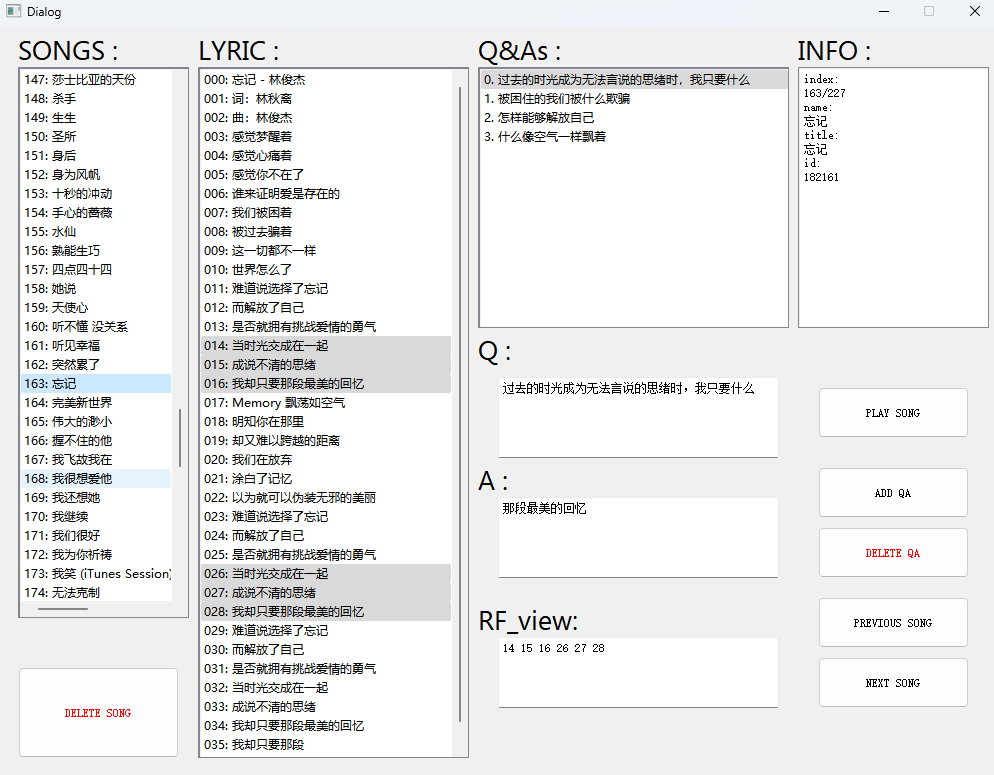

# JJQA: a Chinese QA dataset on the lyrics of JJ Lin's songs

<center>


JJ Lin

</center>

**[here](https://github.com/bebetterest/JJQA) for the latest JJQA.**

**JJQA is now available in 🤗Huggingface. ([click here](https://huggingface.co/datasets/hobeter/JJQA))**

**NOTE: This is a sub-project of [**Open-Source-AI-Research**](https://github.com/OpenSource-Research/Open-Source-AI-Research#open-source-ai-research), an experimental non-profit project focusing on AI research in an open source mode.**

**JJQA is under construction. Welcome to contribute.**

Large Language Models (LLMs) have shown powerful capability of text understanding, analysis and generation. It seems a good tool for text-style knowledge based question answering (QA) where semantically retrieving related texts, understanding them and generating correct answers are required.

However, many feasible QA datasets are not challenging enough. First, given text-style knowledge might be easy to perceive and analyse. Second, the questions & answers follow commonsense. Thus, LLMs may benefit from training of language modeling and even take a shortcut. In this case, we want to build a new text-style knowledge based logical QA dataset where the text-style knowledge is tricky and LLMs are not likely to give correct answers without successfully retrieving and reasoning related texts.

Chinese is a language where each single character could contain abundant meanings while just a few words, especially pieces of lyrics, are able to express complex conceptions, feelings and impressions. <font color=Purple size="">Besides, Junjie Lin, known as **[JJ Lin](https://www.jjlin.com/home/news/all)**, is a famous Singaporean Mandarin singer.</font> The lyrics of his songs are always imaginative, poetic and romantic.

Hense, we propose JJQA, a Chinese text-style knowledge based question answering dataset on the lyrics of JJ Lin's songs, where related lyrics are provided as text-style knowledge for retrieval while the questions and answers are based on the lyrics. The Q&As are always abstract and follow anti-commonsense. For example, according to the related lyrics of a song called "爱情Yogurt", the question is "热量有什么作用？" ("What is the impact of heat?") and the answer is "降低爱情的过敏反应。" ("Ease the anaphylaxis of love"). It is indeed ridiculous and funny (you could find more in the dataset)🤪. Even human beings could not give the right answer without knowing the related lyrics. In addition, LLMs are not likely to naturally generate the right answer with the capability from training. Therefore, only if the related lyrics are retrieved and understood, are the right answers possibly generated By LLMs.

- [How to Start](#how-to-start)
- [Repository Structure](#repository-structure)
- [Dataset Details](#dataset-details)
- [Baselines](#baselines)
- [Discussion](#discussion)
- [How to Contribute](#how-to-contribute)
- [Update Logs](#update-logs)
- [Cite](#cite)
- [Inspired work](#inspired-work)

## How to Start

As shown in [start.ipynb](start.ipynb), you could load JJQA from local repository files or huggingface online.

```python
from datasets import load_dataset
import json

# # load from local repository files
# qas = load_dataset("../JJQA","qa")["train"]
# songs = load_dataset("../JJQA","song")["train"]
# song_index=json.loads(load_dataset("hobeter/JJQA","song_index")["train"]["dic"][0])[0]

# load from huggingface online
qas = load_dataset("hobeter/JJQA","qa")["train"]
songs = load_dataset("hobeter/JJQA","song")["train"]
song_index=json.loads(load_dataset("hobeter/JJQA","song_index")["train"]["dic"][0])[0]
```

## Repository Structure

- *README.md*: the readme file of this repository
- ***./dataset***: scripts and results for building JJQA
  - *1_get_data.py*: to crawl music data => (*song_info.json*)
  - *2_clean_data.py*: to automatically clean data => (*cleaned_song_info.json*)
  - *3_label.py*: to add/del/edit Q&As with a **annotation GUI tool** => (*q_a_dic.json*, *q_a_song_dic.json*)
  - *4_2HF.py*: to construct dataset files=> (*hf_q_a.json*, *hf_song.json*, *hf_song_indx.json*)
  - *Ui_label.ui*: the GUI file for QtDesigner
  - *Ui_label.py*: the python script complied from *Ui_label.ui*
  - *geckodriver.exe*: the firefox driver for selenium
- ***./JJQA***: local JJQA dataset in the huggingface datasets format
  - *hf_q_a.json*, *hf_song.json*, *hf_song_indx.json*: copies from *../dataset*
  - *JJQA.py*: the dataset loading script
  - *README.md*: the readme file of JJQA in huggingface
- ***./baseline***: scripts and results for baselines
  - *1_baseline.ipynb*: to run a baseline => (*{model}_{mode}_dic.json*)
  - *2_get_bertscore.ipynb*: to get metrics (Precision, Recall, F1) from baseline results => (*{model}_{mode}_bertscore.npz*)
- *JJL.jpg*: a picture of JJ Lin
- *start.ipynb*: an example to easily load JJQA
- *LICENSE*: the license file of this repository

<center>



Annotation_GUI_tool

</center>

## Dataset Details

JJQA is now available in 🤗Huggingface. ([click here](https://huggingface.co/datasets/hobeter/JJQA))

According to [QQMusicSpider](https://github.com/yangjianxin1/QQMusicSpider), we crawled lyrics of all songs of JJ Lin from [QQMusic](https://y.qq.com/). After data cleaning and label annotation, 648 Q&As with 181 related song lyrics are included.

Three fields ("qa", "song", "song_index") are included in JJQA.

"qa" contains Q&As with 6 features. "q" and "a" are a question and the corresponding answer. "song_title" and "song_id" are the title and the corresponding id of the related song. "id" is the id for the Q&A. "rf" locates the lines of lyrics for reference, splited by a space " ".

"song" contains information of songs with 4 features. "title" and "name" are the title and the corresponding name of the song. "id" is the id of the song. "lyric" is the lyrics of the song, where each line is splited by "\n".

"song_index" contains one dictionary, whose keys are the ids of songs and values are indexes of the corresponding song in "song" field, to align QAs with the corresponding songs.

## Baselines

We evaluate three baseline methods on JJQA. The first one (*wo_info*) is to "ask" the question directly without any additional lyric, which is to show the performance of uninformed LLMs; the second one (*w_song*) is to include whole lyrics of the related song as in-contexts; the third one (*w_rf*) is to just include related lyrics. *w_song* and *w_rf* are two reference lines for retrieval-based method.

Six feasible LLMs (*ernie-turbo*, *chatglm2_6b_32k*, *qwen-turbo*, *baichuan2-7b-chat-v1*, *gpt-4*, *gpt-3.5-turbo*) are included. We apply *ernie-turbo* and *chatglm2_6b_32k* in [qianfan platform](https://cloud.baidu.com/product/wenxinworkshop); *qwen-turbo* and *baichuan2-7b-chat-v1* in [dashscope platform](https://dashscope.aliyun.com/); *gpt-4* and *gpt-3.5-turbo* in [openai platform](https://platform.openai.com/).

We consider [BERTScore](https://github.com/Tiiiger/bert_score) with *rescale_with_baseline=True* as the metric.

The results are as follows.

|LLM|Method|Precision|Recall|F1|Date|
|:---|:---:|:---:|:---:|:---:|:---:|
|*ernie-turbo*|*wo_info*|-0.0350|0.1568|0.0511|2023/11/06|
|*ernie-turbo*|*w_song*|0.2472|0.5765|0.3895|2023/11/06|
|*ernie-turbo*|*w_rf*|0.3600|0.6528|0.4864|2023/11/06|2023/11/05|
|*chatglm2_6b_32k*|*wo_info*|0.0466|0.1787|0.1066|2023/11/05|
|*chatglm2_6b_32k*|*w_song*|0.2361|0.4606|0.3335|2023/11/05|
|*chatglm2_6b_32k*|*w_rf*|0.4650|0.6477|0.5436|2023/11/05|
|*qwen-turbo*|*wo_info*|0.2331|0.2150|0.2208|2023/11/05|
|*qwen-turbo*|*w_song*|0.7673|0.8041|0.7804|2023/11/05|
|*qwen-turbo*|*w_rf*|0.8600|0.8251|0.8386|2023/11/05|
|*baichuan2-7b-chat-v1*|*wo_info*|0.1755|0.2012|0.1857|2023/11/05|
|*baichuan2-7b-chat-v1*|*w_song*|0.4635|0.6324|0.5371|2023/11/05|
|*baichuan2-7b-chat-v1*|*w_rf*|0.6567|0.7272|0.6851|2023/11/05|
|*gpt-3.5-turbo*|*wo_info*|0.2201|0.1983|0.2061|2023/11/06|
|*gpt-3.5-turbo*|*w_song*|0.8031|0.7812|0.7884|2023/11/06|
|*gpt-3.5-turbo*|*w_rf*|0.8110|0.7484|0.7758|2023/11/06|
|*gpt-4*|*wo_info*|0.2426|0.2377|0.2376|2023/11/06|
|*gpt-4*|*w_song*|0.8405|0.8587|0.8464|2023/11/06|
|*gpt-4*|*w_rf*|0.8865|0.8643|0.8732|2023/11/06|
|*gpt-4-1106-preview*|*without_info*|0.2345|0.2061|0.2179|2023/11/09|
|*gpt-4-1106-preview*|*with_whole_song*|0.8411|0.8117|0.8231|2023/11/09|
|*gpt-4-1106-preview*|*with_rf*|0.8230|0.7678|0.7921|2023/11/09|

It is worth noting that *Date* stands for the time (UTC+8) for evaluation. In addition, a small number of samples are not feasible in the dashscope platform because of its safety system. We just skip these Q&As. (1 sample for *qwen-turbo* *wo_info*; 3 samples for *qwen-turbo* *w_song*; 3 samples for *baichuan2-7b-chat-v1* *w_song*)

## Discussion

We propose JJQA to evaluate the capability of a LLM on semantical retrieval and answer generation following contexts in Chinese. Further work could focus on how to implement effective semantical song/line-wise retrieval or enhanced answer generation. In addition, JJQA could be updated with Q&As of better quality or explanded to a larger dataset with Q&As on lyrics of different singers and even in different languages.

## How to Contribute

First of all, please read the contribution **terms** carefully in [**Open-Source-AI-Research**](https://github.com/OpenSource-Research/Open-Source-AI-Research#open-source-ai-research)**.**

Second, fork this repository, make some improvements, add a record in Update Logs and just pull a request, which also means that you have already accepted the terms **by default**.

Thanks for your contribution!!!

## Update Logs

2023\_11\_13 - bebetterest - bebetterest@outlook.com

DONE: add an evaluation result for gpt-4-turbo (gpt-4-1106-preview); implement openai assistants API as a baseline, but the full result is not available because it's expensive; add open-source scripts&results on building JJQA and evaluating baselines; add introductions on the repository structure and how to start. 

TODO: update Section Cite, update the results on the assistants API baseline; polish readme; rereview and update the dataset; explore some retrieval methods or generation enhancement methods...

---

2023\_11\_06 - bebetterest - bebetterest@outlook.com

DONE: initialized the first version of JJQA and baseline performance.

TODO: polish readme; add details on the annotation tool; open source related codes; rereview and update the dataset; explore some retrieval methods or generation enhancement methods...


## Cite

Please cite this if your work is motivated from it.

```
@misc{JJQA,
  title = {JJQA: a Chinese QA dataset on the lyrics of JJ Lin's songs},
  author = {O.S.R.},
  howpublished = {\url{https://github.com/bebetterest/JJQA}},
}
```


## Inspired work

To be added...